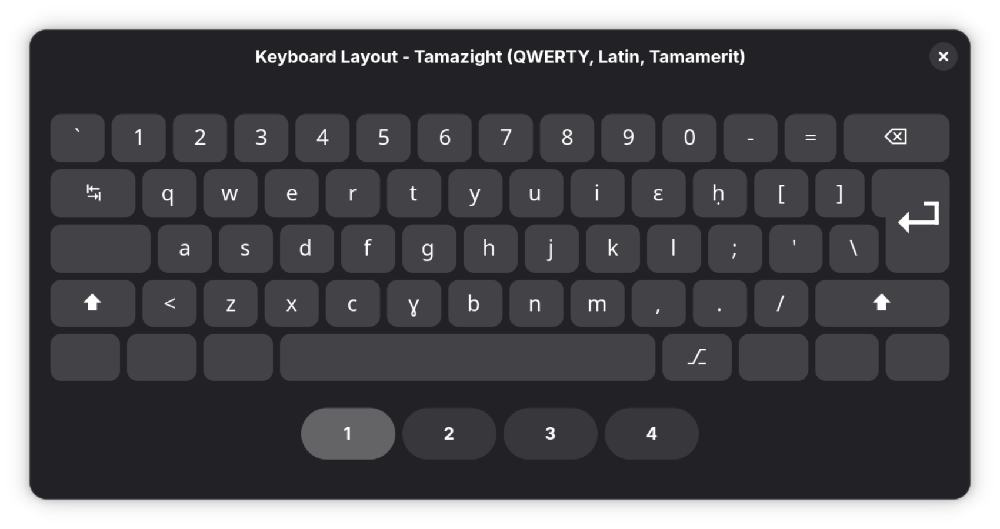
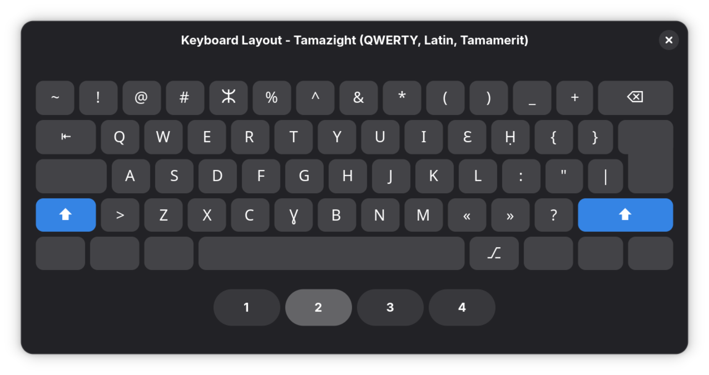
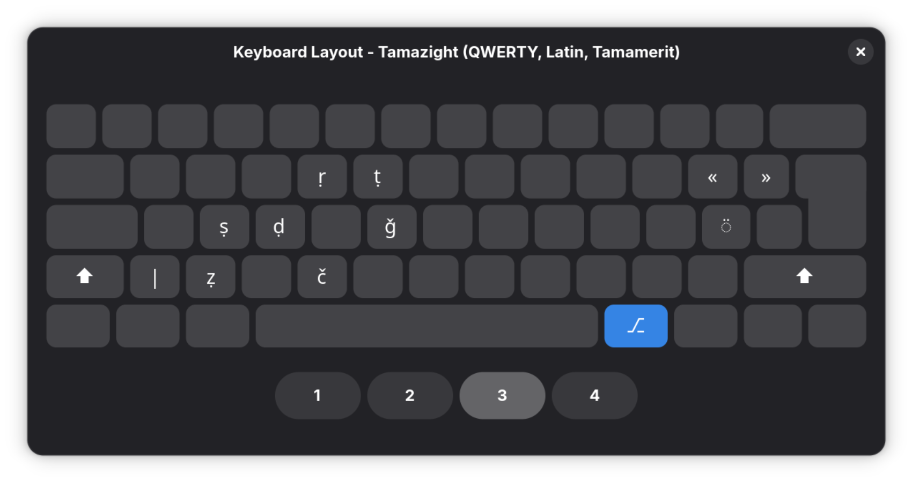
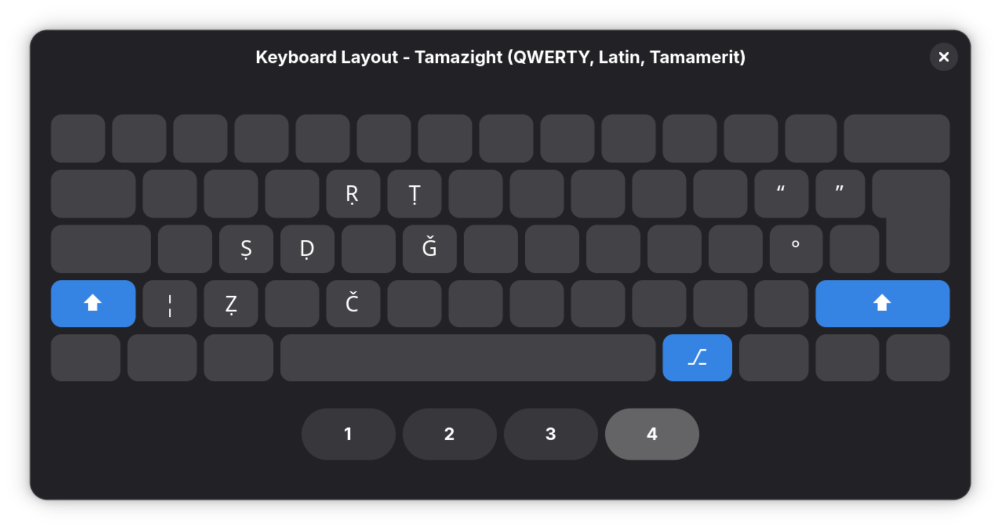

# ⌨️ Tamazight Keyboard Layout for Linux

A one-script installer that adds a **Tamazight (QWERTY - Latin - Tamamerit) keyboard layout** to GNOME on Linux — no manual XKB editing, no reboot required.

---

## What It Does

The layout follows a **QWERTY base** and adds Tamazight-specific characters where they naturally belong, using the **Shift** layer for uppercase and dedicated keys for phonemes that don't exist in standard Latin.

### Keyboard layout






_Visual reference for the key mapping._

---

## Requirements

- Linux with **GNOME** desktop environment
- `gsettings` (ships with GNOME)
- `python3` (used internally to safely parse gsettings values)
- Bash 4+

Tested on **Fedora 49** (Wayland). Should work on Ubuntu/Debian GNOME, openSUSE, Arch+GNOME, and similar.

---

## Installation

```bash
# Clone or download the script
git clone https://github.com/m4sensen/tamazight-latin-keyboard.git
cd tamazight-latin-keyboard

bash main.sh install
```

The script will:

1. Write the XKB symbols file to `~/.config/xkb/symbols/tmz`
2. Write the rules file to `~/.config/xkb/rules/evdev.xml`
3. Add the layout to GNOME's input sources via `gsettings`

No `sudo` needed. Everything installs to your home directory.

---

## Switching to the Layout

After installation, switch layouts with:

```
Super + Space
```

Or open **Settings → Keyboard → Input Sources** to manage layouts visually.

The layout appears as **"Tamazight (QWERTY, Latin, Tamamerit)"** in the GNOME input source selector.


_Screenshot showing the layout in GNOME input sources._

---

## Uninstallation

```bash
bash main.sh uninstall
```

This removes both the XKB files and the entry from GNOME's input sources. Your other layouts remain untouched.

---

## How It Works

GNOME supports **user-local XKB configuration** at `~/.config/xkb/` — no system-wide files are touched. The script places two files:

```
~/.config/xkb/
├── symbols/
│   └── tmz          ← XKB symbols definition (the actual key mappings)
└── rules/
    └── evdev.xml    ← Layout metadata (name, language tag, variant list)
```

The layout is then registered in GNOME's input sources using `gsettings`, which handles both Wayland (libxkbcommon reads `~/.config/xkb` natively) and X11 (GNOME applies it via setxkbmap on session start).

`gsettings` values are parsed with `python3 -c "import ast, os; ..."` using environment variables to safely handle shell quoting — no `eval`, no injection risk.

---

## Layout Design Decisions

- Emphatic consonants at Level 3 (AltGr) — ṣ ḍ ṭ ṛ ẓ are placed on AltGr+s d t r z because they are phonetically the emphatic versions of those exact consonants. The physical relationship between the plain and emphatic form is built into the layout itself.
- o → ɛ and v → ɣ — Tamazight has no o or v sounds. Rather than leaving those keys as dead weight, they are replaced entirely with ɛ (epsilon) and ɣ (gamma) — two phonemes that are central to the language and now have dedicated, unshifted keys.
- ḥ is not on h — typing ḥ requires holding Right Alt, but h is on the right side of the keyboard — directly above the Right Alt key. Reaching both simultaneously is physically awkward. Placing ḥ on p instead (an unused key, since Tamazight has no p sound) keeps it accessible with a comfortable left-hand + right-thumb motion.
- ⵣ replaces $ on Shift+4 — Amazighs has no currency symbol on the keyboard that reflects daily life. ⵣ (Tifinagh Yaz) is not just a character — it is the symbol of Amazigh identity. It belongs on the keyboard at least as much as a dollar sign does, and Shift+4 gives it a permanent, easy-to-remember home.
- « and » replace < and > — Tamazight is a spoken language with a rich oral tradition. When it is written, quotation marks appear constantly, so they replace the angle brackets that would otherwise sit unused on those keys.

---

## File Reference

| File                            | Location     | Purpose                       |
| ------------------------------- | ------------ | ----------------------------- |
| `main.sh`                       | Project root | Main install/uninstall script |
| `~/.config/xkb/symbols/tmz`     | User XKB dir | Key mapping definitions       |
| `~/.config/xkb/rules/evdev.xml` | User XKB dir | Layout registration metadata  |

---

## Troubleshooting

**Layout doesn't appear in GNOME Settings**
Log out and back in. GNOME caches input sources on session start.

**Characters don't type correctly on Wayland**
Ensure your compositor reads `~/.config/xkb`. This is standard in GNOME 42+ but may require a session restart after first install.

**AltGr characters don't work**
The layout uses `include "level3(ralt_switch)"` which maps Right Alt to the Level 3 modifier. If your keyboard remaps Right Alt, this won't work without adjusting the symbols file.

**Script fails on non-GNOME desktops**
This script is GNOME-specific. For KDE, XFCE, or bare X11 setups, the XKB files can still be used — but you'll need to apply them manually (e.g. via `setxkbmap`).

---

## Contributing

Issues, corrections to the key mappings, and compatibility reports from other distros are all welcome. Open an issue or submit a pull request.

---

## License

This project is dedicated to the public domain under CC0 1.0. See [LICENSE](LICENSE)
for details.

---

_Made with love for Tamazight. ❤️ⵣ_
